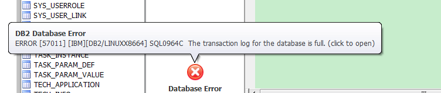

DB2 常见问题排查
====

##  备份或者还原未完成

### 问题

执行操作，提示如下：

```
[db2inst@localhost ~]$ db2 deactivate db necc_db
SQL1120N  A connection to or activation of database "NECC_DB" cannot be made 
because a previous backup or restore is incomplete.  SQLSTATE=57019
```

### 排查

根据 <https://www.ibm.com/support/knowledgecenter/SSEPGG_9.7.0/com.ibm.db2.luw.messages.sql.doc/doc/msql01120n.html>
描述：“因为先前备份或复原不完整，所以不能连接或激活数据库 名称。”

### 解决

直接删除了数据，再执行还原该数据库

```
[db2inst@localhost ~]$ db2 drop db necc_db
DB20000I  The DROP DATABASE command completed successfully.
```


## 还原完后不能连接到数据库

### 问题

从备份中恢复DB2数据库（本例是指“NECC_DB”）的拷贝到新的DB2服务器（本例是指“NECC_DBA”）。
用户已创建一个新的数据库连接（指向这个新的数据库副本），当试图连接这个新的数据库时，提示如下错误:

```
[db2inst@localhost ~]$ db2 connect to necc_db
SQL1117N  A connection to or activation of database "NECC_DB" cannot be made 
because of ROLL-FORWARD PENDING.  SQLSTATE=57019
```

### 排查

出现SQL1117N  由于 ROLL-FORWARD PENDING，不能连接或激活数据库 "NECC_DBA"。

### 解决

将数据库前滚。

执行:

`db2 rollforward db <database> complete`

如：

```
[db2inst@localhost ~]$ db2 rollforward db necc_dba complete

                                 Rollforward Status

 Input database alias                   = necc_dba
 Number of members have returned status = 1

 Member ID                              = 0
 Rollforward status                     = not pending
 Next log file to be read               =
 Log files processed                    =  -
 Last committed transaction             = 2016-04-27-09.18.11.000000 UTC

DB20000I  The ROLLFORWARD command completed successfully.
[db2inst@localhost ~]$ 
```

## 空间不足不能执行命令

### 问题

执行 db2 语句创建或者删除数据库操作，均出现如下提示

```
SQL1004C  There is not enough storage on the file system to process the command.
```
### 排查

用户的磁盘不够了。增加用户磁盘，或者删除一些数据，来增大用户能使用的空间。

### 解决

删除了没有用的数据库和老旧的数据库备份文件。


## 事务日志已经满

### 问题

执行 db2 语句创建数据库索引、或者执行修改操作，均出现如下提示

```
DB2 Database Error: ERROR [57011] [IBM][DB2/LINUXX8664] SQL0964C The transaction log for the database is full.
```



### 排查

事务日志已满。

通过 `db2 => get db cfg` 语句来查看日志文件的配置：

```
 Log file size (4KB)                         (LOGFILSIZ) = 1024
 Number of primary log files                (LOGPRIMARY) = 13
 Number of secondary log files               (LOGSECOND) = 12
```
### 解决

把日志文件的大小和日志文件的数量扩充。

```
db2 => update db cfg using LOGFILSIZ 10240
DB20000I  The UPDATE DATABASE CONFIGURATION command completed successfully.
SQL1363W  Database must be deactivated and reactivated before the changes to 
one or more of the configuration parameters will be effective.
db2 => update db cfg using LOGPRIMARY 100
DB20000I  The UPDATE DATABASE CONFIGURATION command completed successfully.
SQL1363W  Database must be deactivated and reactivated before the changes to 
one or more of the configuration parameters will be effective.
db2 => update db cfg using LOGSECOND 100  
DB20000I  The UPDATE DATABASE CONFIGURATION command completed successfully.
db2 => 
```

## 参考引用

* <http://www-01.ibm.com/support/docview.wss?uid=swg21962486>
* <http://www.cnblogs.com/frankliiu-java/articles/2186343.html>